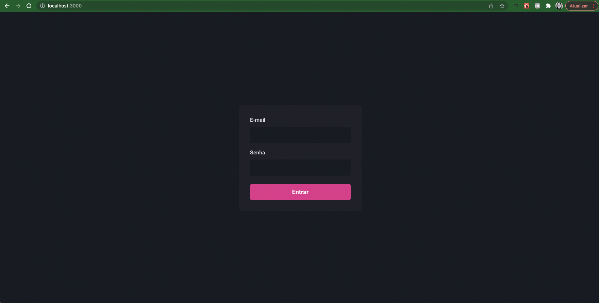
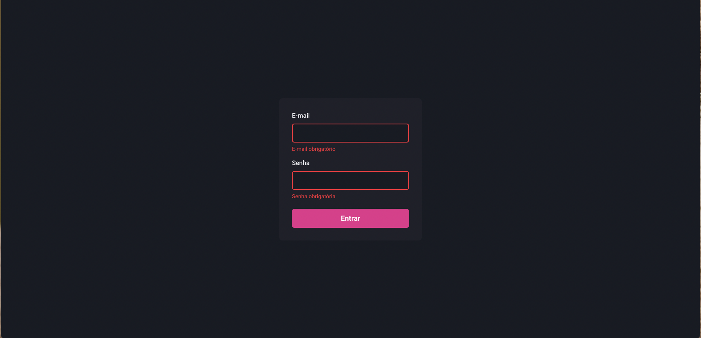
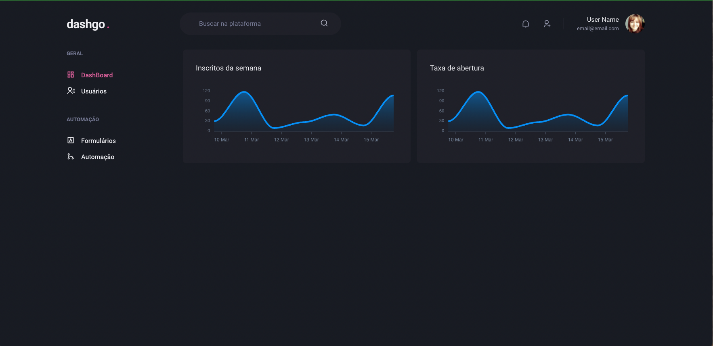
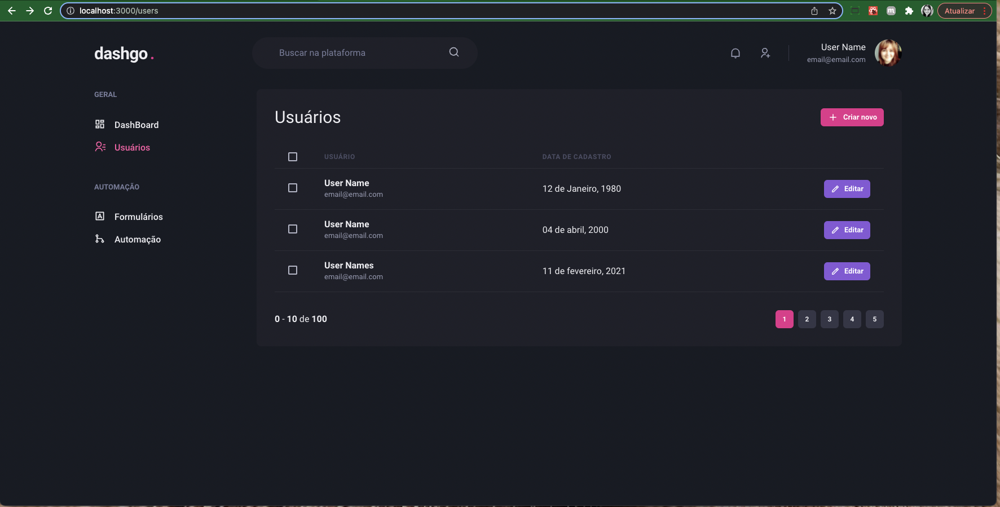
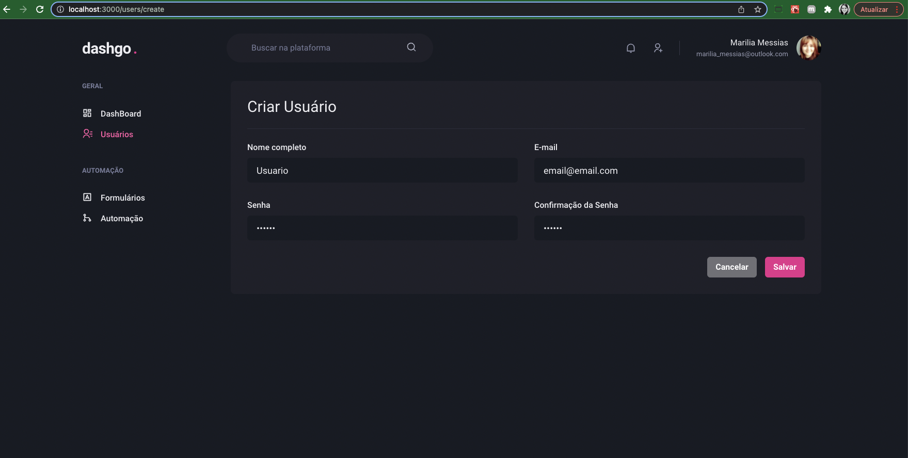
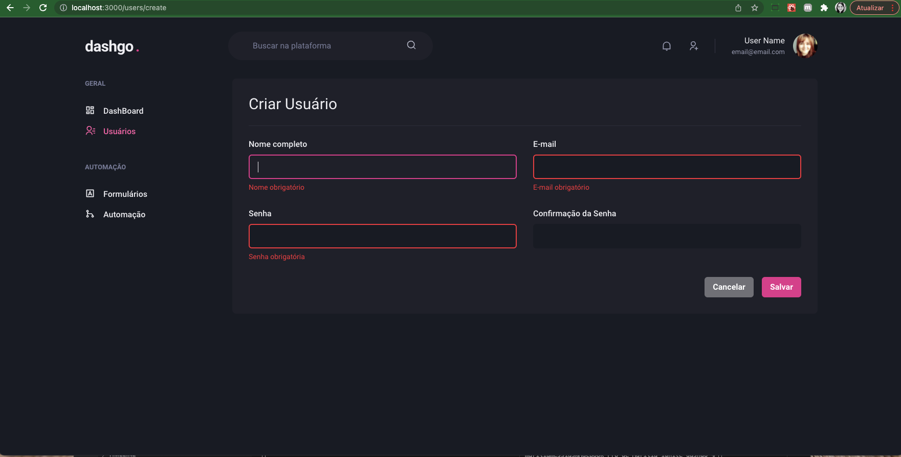
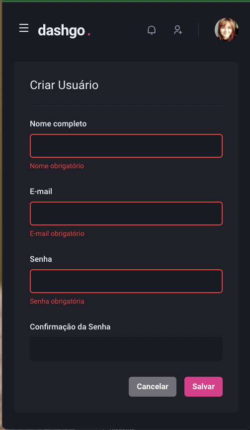

## 🧪 Tecnologias

Esse projeto foi desenvolvido com as seguintes tecnologias:

- [NextJs](https://nextjs.org/)
- [Chakra-ui](https://chakra-ui.com/)
- [Hookform](https://react-hook-form.com/)
- [Yup](https://github.com/jquense/yup)

## 🧪 Telas

Home. Na primeira imagem é possível ver a tela de login com os campos de formulário que utilizei a biblioteca hookForm para criá-los, e logo em seguida temos uma imagem da validação dos campos funcionando, exibindo as mensagens de erro em tempo de digitação, essas mensagens foram personalizadas e as validações criadas através da lib yup.

<h1 align="center">
    
</h1>
<h1 align="center">
    
</h1>
A próxima tela temos um exemplo de dashboards onde temos dois gráficos criados através da lib react-apexcharts.

<br>
<h1 align="center">
    
</h1>
Página de usuários, que permite a visualização dos usuários já cadastrados na plataforma. Para esse cenário consideramos alguns aspectos relacionados a responsividade para garantir uma boa usabilidade quando utilizado em um dispositivo móvel por exemplo.

<br>
<h1 align="center">
    
</h1>
Abaixo temos o formulário de cadastro de novo usuário, que também contempla validação dos campos, tal como valor da senha digitada confirmada, e adicionamos um comportamento de loading no botão de salvar, como uma resposta ao usuário enquanto aguarda o carregamento das informações.

<br>
<h1 align="center">
    
</h1>

<h1 align="center">
    
</h1>

Exemplo de tela responsiva:

<h1 align="center">
    
</h1>

## 🚀 Como executar

Clone o projeto e acesse a pasta do mesmo.

```bash
$ git clone https://github.com/mariliamessias/ignite-dashgo
$ cd ignite-dashgo
```

Para iniciá-lo, siga os passos abaixo:
```bash
# Instalar as dependências
$ yarn

# Iniciar o projeto
$ yarn start
```
O app estará disponível no seu browser pelo endereço http://localhost:3000.

## 💻 Projeto

Projeto do curso Ignite da Rocketseat que tem como objetivo 
criar um criar uma interface resposiva utilizando os recursos da biblioteca chakra-ui, bem como explorar o funcionamento e comportamento de formulários utilizando ReactHookform e Yup.

## 📝 License

Esse projeto está sob a licença MIT. Veja o arquivo [LICENSE](LICENSE.md) para mais detalhes.
